# Parte 2.1 - Docker

## 1 - Contruir y ejecutar una imagen como contenedor

En primer lugar debemos tener un proyecto que queramos "dockerizar" y luego debemos crear un Dockerfile con las instrucciones para crear una imagen de un container.

Luego para crear una imagen se utiliza el comando `docker build -t image-name dir`.

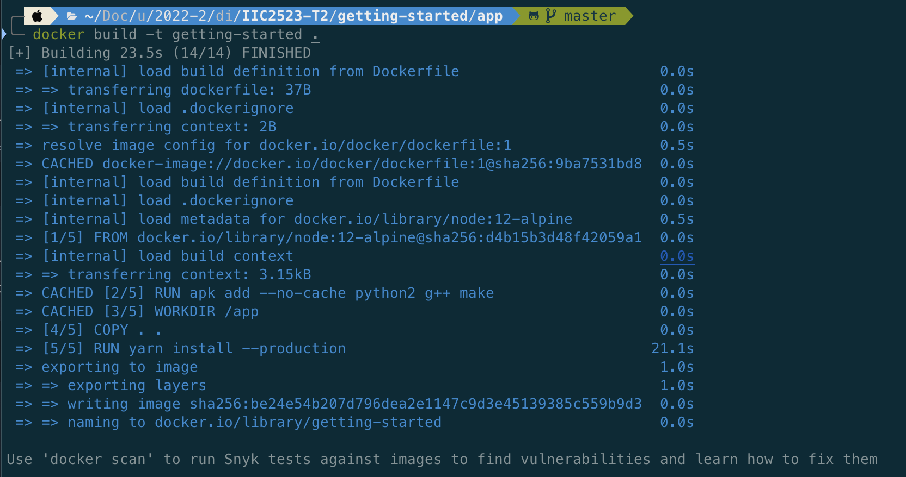

Para correr el contenedor utilizamos `docker run -dp 3000:3000 image-name` donde la flag -d es de detached mode para correr el contenedor en background y -p para hacer un mapping entre nuestro puerto 3000 "real" y el 3000 del contenedor.

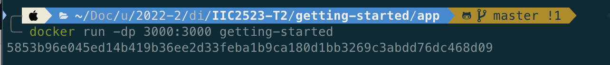

## 2 - Actualizar una aplicación, detener y eliminar un contenedor

Luego de realizar cambios en una aplicación, podemos actualizar la imagen con el mismo comando de creación `docker build -t getting-started .` 

Sin embargo, si queremos levantar de inmediato un contenedor con la nueva imagen tendremos un error ya que el contenedor antiguo sigue corriendo con la imagen anterior.

Para mostrar los contenedores en consola utilizamos `docker ps`

Para detener un contenedor utilizamos `docker stop CONTAINER_ID`

Luego de ello podemos eliminar el contenedor con `docker rm CONTAINER_ID`

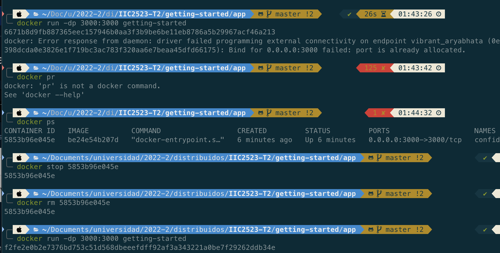

## 3 - Compartir una imagen via docker hub

En primer lugar hay que crear una cuenta en dockerhub y crear un repositorio.

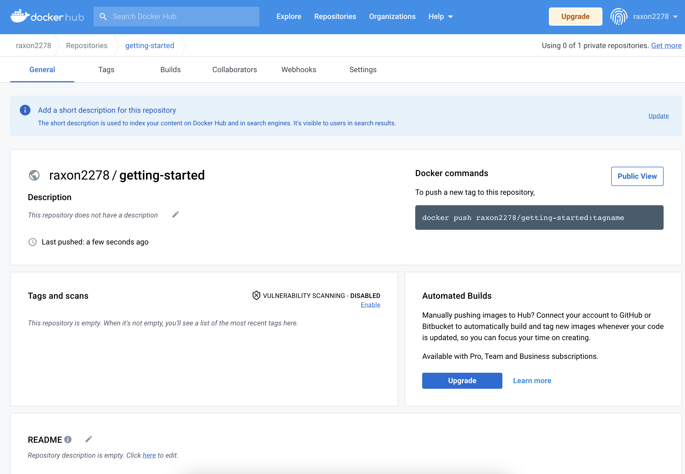

Para poder subir imágenes deben tener un tag, que se pueden asignar con `docker tag getting-started YOUR-USER-NAME/getting-started` luego con `docker push tag` podemos subir la imagen.

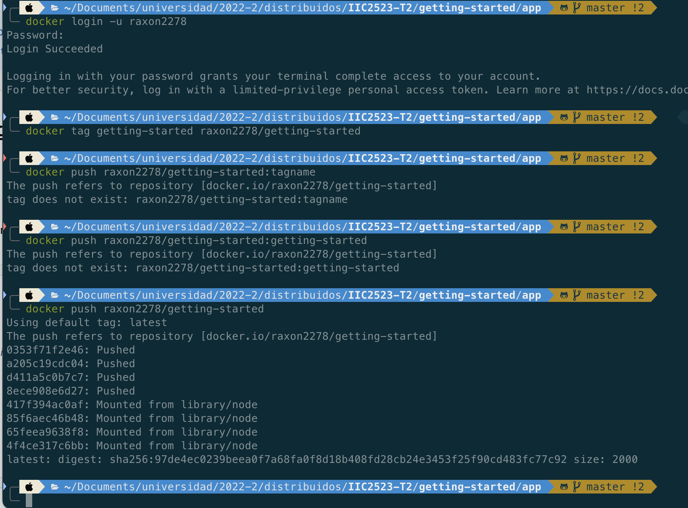

Con lo anterior ya podemos pullear y correr la imagen desde cualquier lugar con docker.

## 3 - Persistencia en la DB

En primer lugar tenemos los "named volume" que en palabras simples son buckets de data, para crear una utilizamos `docker volume create NAME`. Luego cuando iniciamos un container, podemos especificar un volumen a utilizar con `docker run -dp 3000:3000 -v VOLUME-NAME:DIR getting-started`.

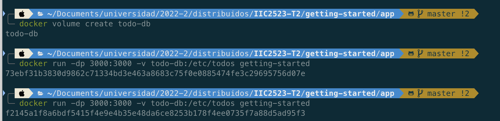

## 4 - Bind Mounts

Podemos crear "dev-mode" containers que se actualizan al hacer cambios en la aplicación con `docker run -dp 3000:3000 \
     -w /app -v "$(pwd):/app" \
     node:12-alpine \
     sh -c "apk add --no-cache python2 g++ make && yarn install && yarn run dev"`

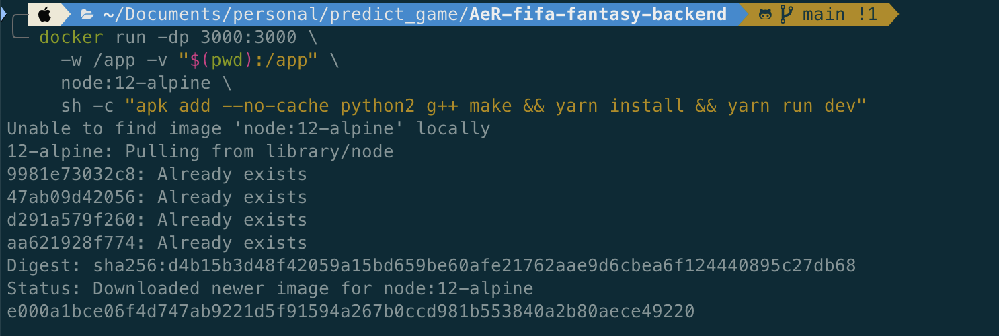

## 5 - Multi container apps

Dos (o mas) contenedores solo se pueden comunicar si comparten una red, podemos crear una con `docker network create NAME` y luego podemos correr un contenedor y conectarlo a una red con 

    `docker run -d \
     --network todo-app --network-alias mysql \
     --platform "linux/amd64" \
     -v todo-mysql-data:/var/lib/mysql \
     -e MYSQL_ROOT_PASSWORD=secret \
     -e MYSQL_DATABASE=todos \
     mysql:5.7`

Asignando la red y un alias.

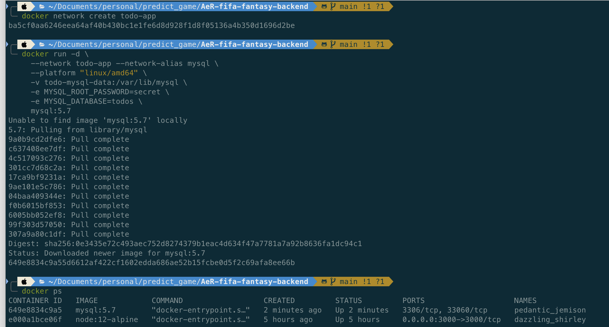

Luego sabiendo que en el caso del tutorial el host es "mysql", podemos correr el contenedor base con

`
docker run -dp 3000:3000 \
   -w /app -v "$(pwd):/app" \
   --network todo-app \
   -e MYSQL_HOST=mysql \
   -e MYSQL_USER=root \
   -e MYSQL_PASSWORD=secret \
   -e MYSQL_DB=todos \
   node:12-alpine \
   sh -c "apk add --no-cache python2 g++ make && yarn install && yarn run dev"
`

y con ello estará conectado al contenedor de mysql creado anteriormente.

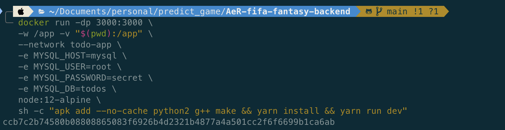

## 6 - Docker Compose

Con Docker Compose podemos definir y crear aplicaciones multi container con un YAML de manera mucho más fácil.

En primer lugar debemos crear un archivo docker-compose.yml en el root del proyecto, en donde definimos los servicios, equivalente al comando grande de "docker run" utilizado anteriormente. En este YAML definimos la imagen a utilizar, el comando a correr, los puertos, volúmenes, env vars, etc...

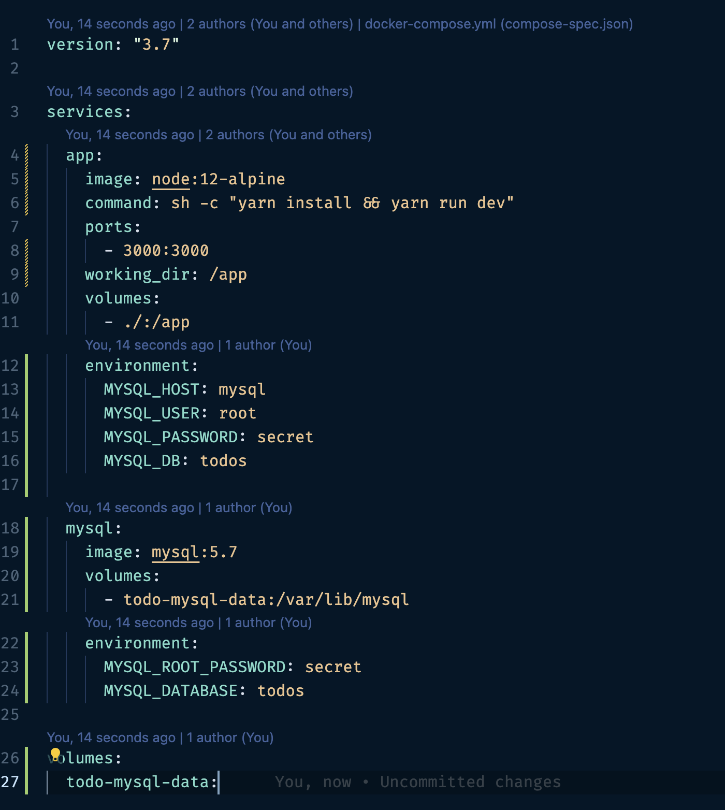

Luego con `docker-compose up -d` corremos todos los contenedores y servicios declarados anteriormente y podemos ver sus logs con `docker compose logs -f`

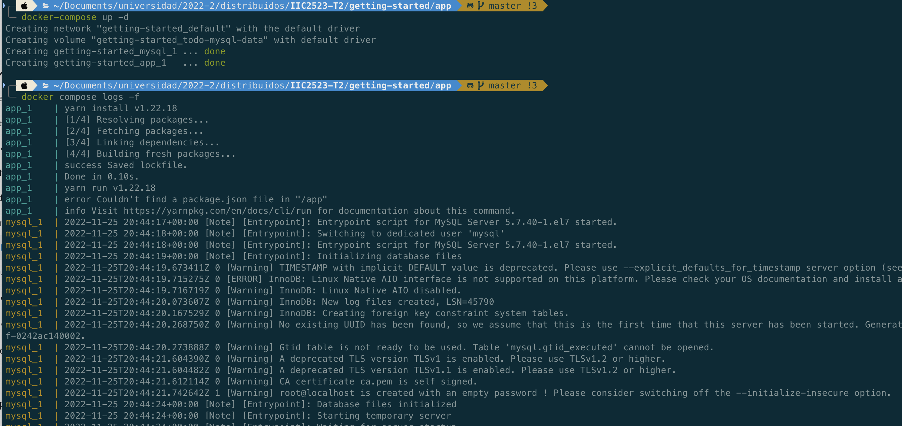

Con `docker-compose down` podemos bajar todos los contenedores de la app con un solo comando.

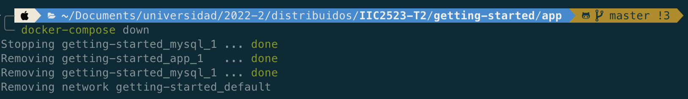

# Parte 2.2 Docker Golang

## 1 - Crear imagen de GO

Creamos un dockerfile que utiliza una imagen base de go y configuración básica donde cambiamos el workdir, y movemos algunos archivos antes de correr `go mod download` para luego hacer build.

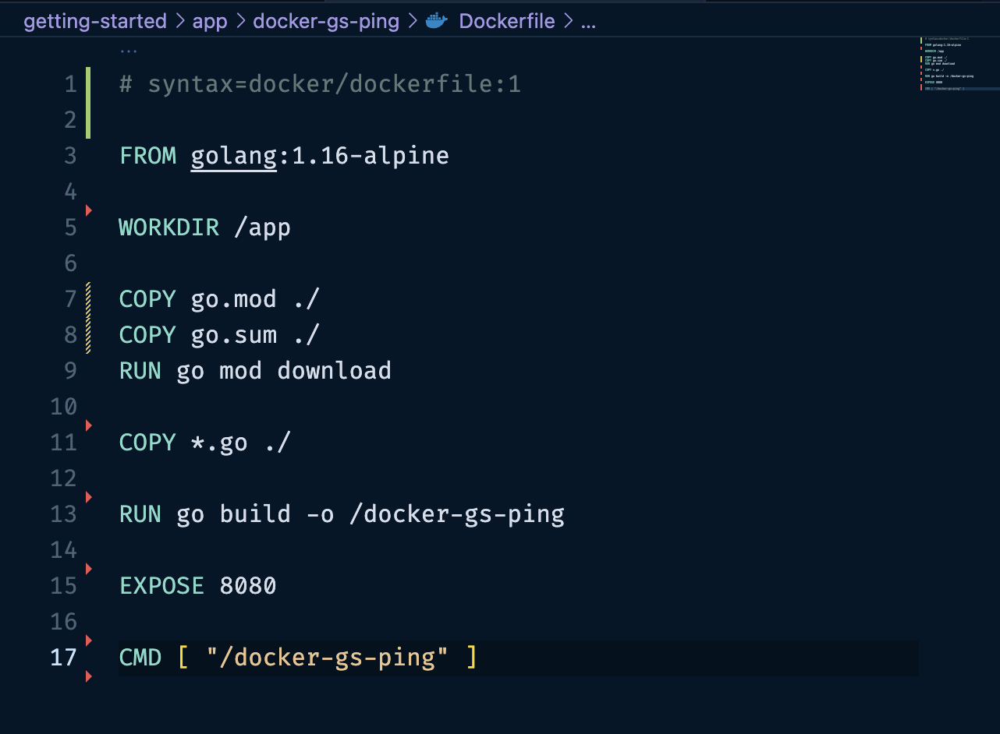

Ahora ya podemos hacer docker build con `docker build --tag docker-gs-ping .`

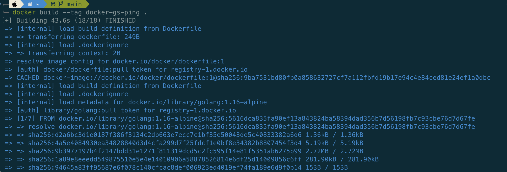

Luego podemos crear un nuevo tag para la imagen con `docker image tag docker-gs-ping:latest docker-gs-ping:v1.0`.

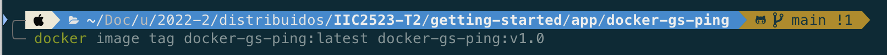

Y también quitar tags con `docker image rm docker-gs-ping:v1.0`

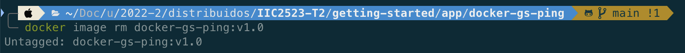

Podemos crear un multi-stage build para reducir el tamaño de las imagenes, para ello creamos un nuevo dockerfile.

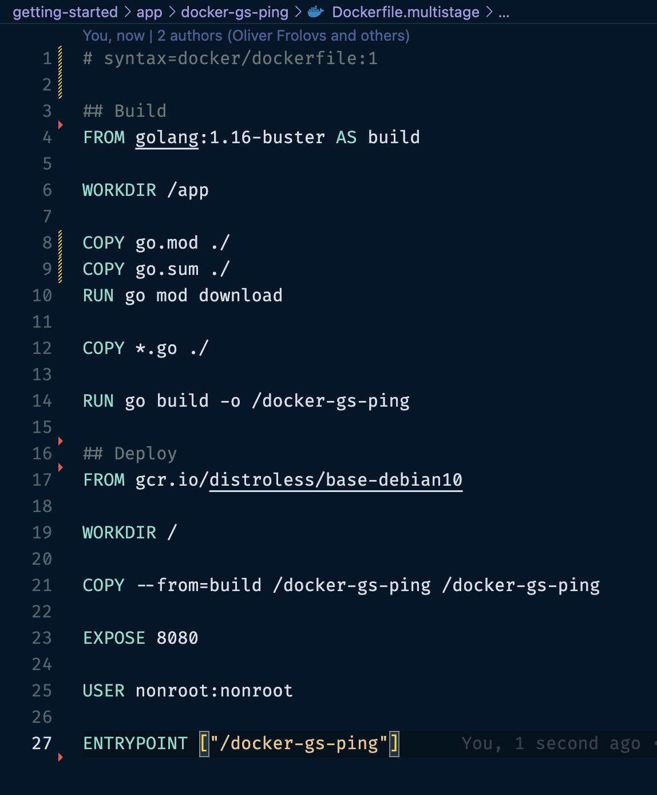

Buildeamos la nueva imagen con el tag de multistage `docker build -t docker-gs-ping:multistage -f Dockerfile.multistage .`

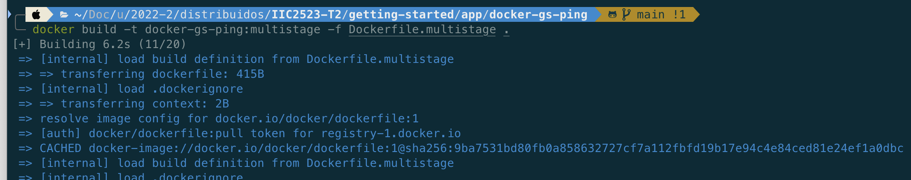

Y con ello el tamaño de la nueva imagen es considerablemente menor.

## 2 - Correr una imagen en un contenedor

Podemos correr una imagen exponiendo el puerto "interno" del contenedor al real con `docker run --publish 8080:8080 docker-gs-ping`

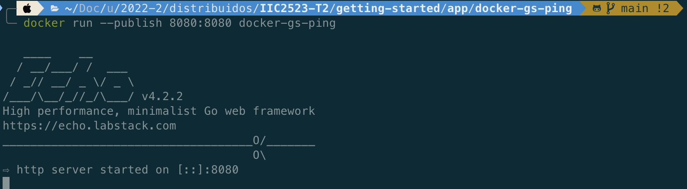

Y comprobamos de que efectivamente podemos hacer requests al servidor.

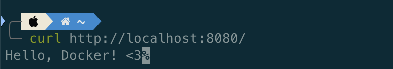

En general podemos realizar todas las acciones que hicimos en la parte 1 de este tutorial ya que es un contenedor igual que el resto, solo que con una imagen de GO.

## 3 - Container para development

En el tutorial, para la DB se utilizo CockroachDB.

Comenzamos creando un volumen con `docker volume create roach`

Y una bridge network con `docker network create -d bridge mynet`

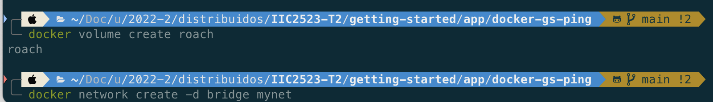

Corremos un contenedor con el motor de la DB antes mencionado y lo conectamos a la red creada recientemente con:

`
docker run -d \
  --name roach \
  --hostname db \
  --network mynet \
  -p 26257:26257 \
  -p 8080:8080 \
  -v roach:/cockroach/cockroach-data \
  cockroachdb/cockroach:latest-v20.1 start-single-node \
  --insecure
`

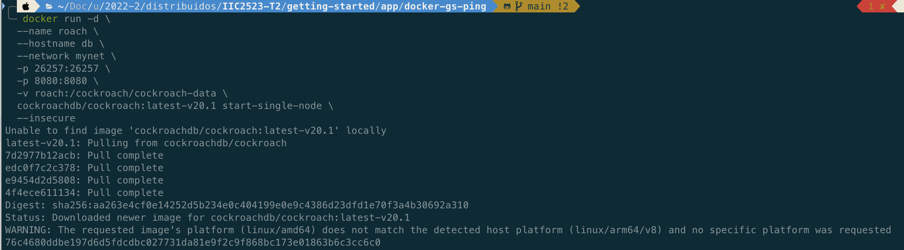

Y luego pasamos a la configuración de la DB:

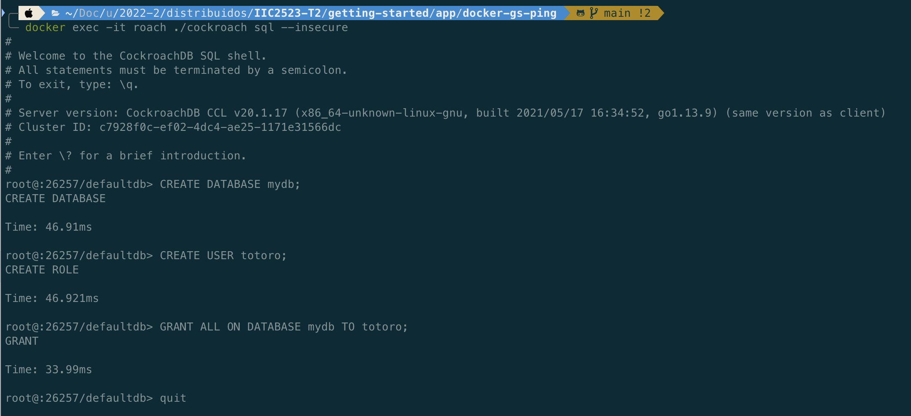

Luego de esto ya podemos hacer build de nuestra aplicación y correr nuestro contenedor.

`
docker build --tag docker-gs-ping-roach .
`

`
docker run -it --rm -d \
  --network mynet \
  --name rest-server \
  -p 80:8080 \
  -e PGUSER=totoro \
  -e PGPASSWORD=myfriend \
  -e PGHOST=db \
  -e PGPORT=26257 \
  -e PGDATABASE=mydb \
  docker-gs-ping-roach
`

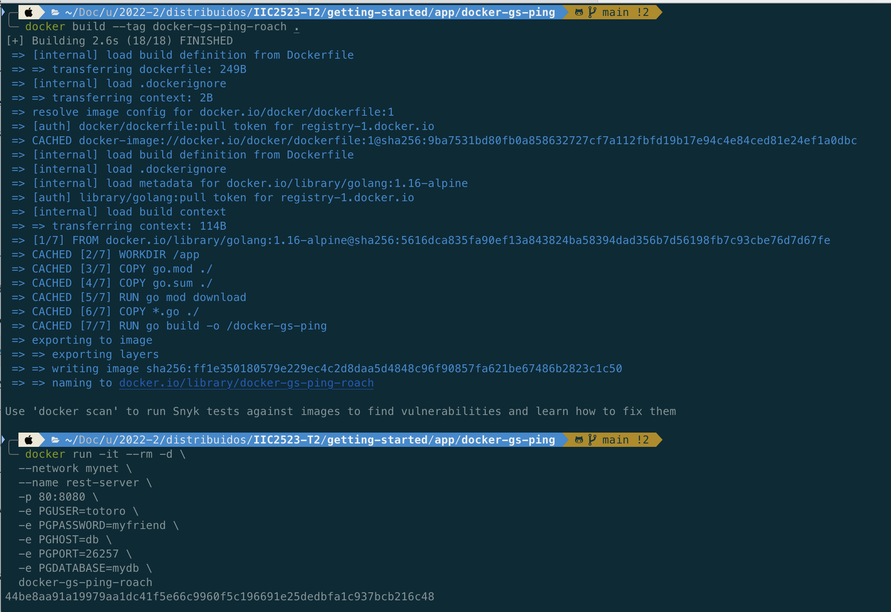

Ahora, esto se puede realizar de una forma mucho más eficiente con docker-compose.

Creamos un archivo docker-compose.yml en el root del proyecto.

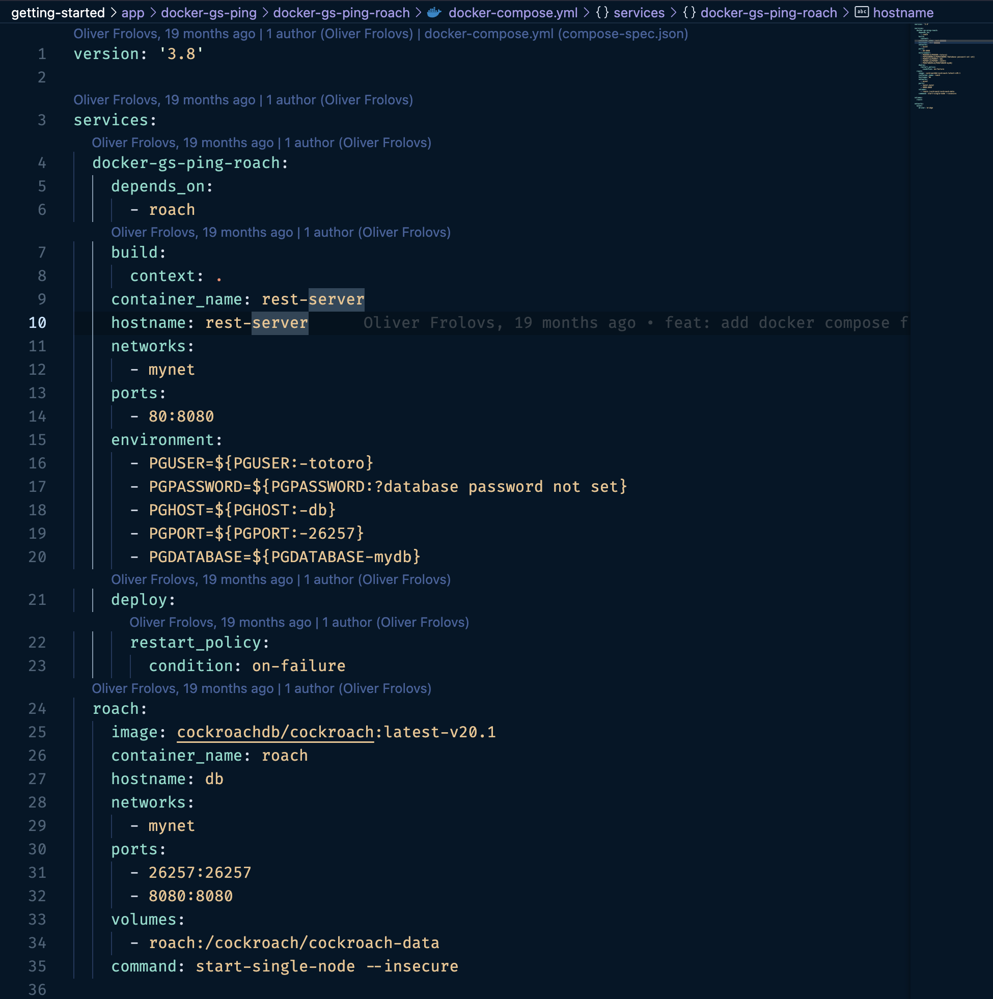

Nuestro docker-compose va a leer automáticamente las variables de entorno desde un archivo .env, por lo que agregamos ahí las variables de entorno.

Además, podemos validar si el archivo docker-compose.yml es válido con `docker-compose config`

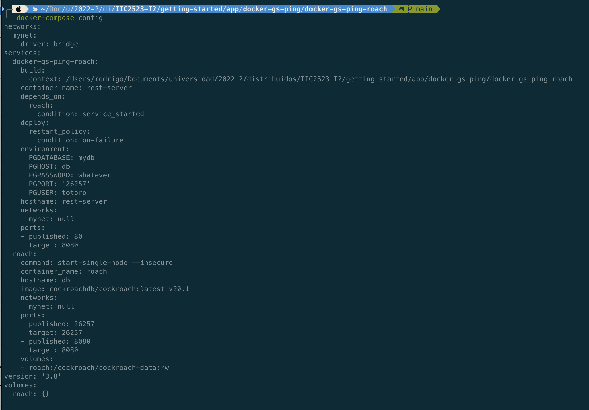

Finalmente buildeamos y corremos la aplicación con `docker-compose up --build`

Nos encontramos con un error de conexión a la base de datos pero es por que debemos volver a configurar la DB, en particular con este docker-compose estamos creando un container completamente nuevo de cockroachDB, luego de ello podemos volver a ejecutar el build.

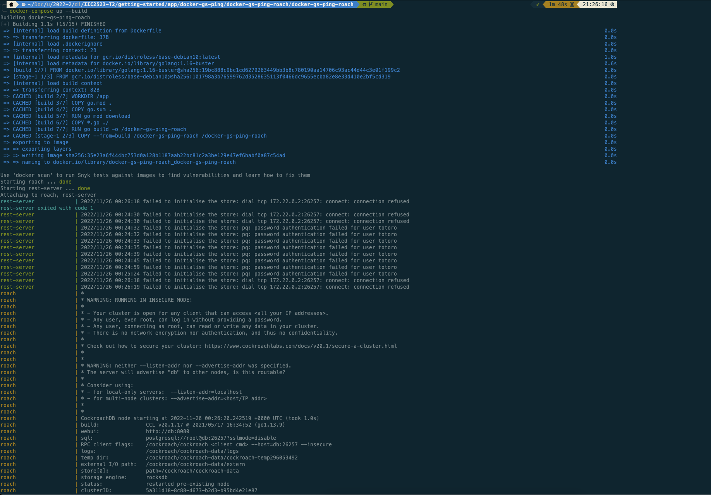

Podemos comprobar que la aplicación funciona correctamente.

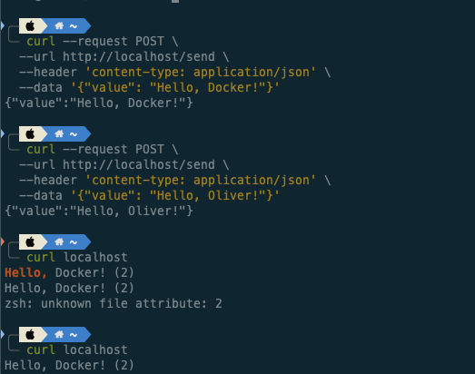

## 4 - Correr tests

Los tests los podemos crear pensando directamente en docker, en particular en el tutorial se utiliza el módulo ory/dockertest de GO y en general los tests asumen que se está corriendo docker en la misma máquina en la que se están corriendo los tests e interactúan directamente con los containers.

Lo que hace el módulo es solicitar un nuevo contenedor utilizando la imagen seleccionada con el tag correspondiente y reintenta hasta que el contenedor esté arriba.

Podemos probar los tests del repo del tutorial con `go test -v ./...`

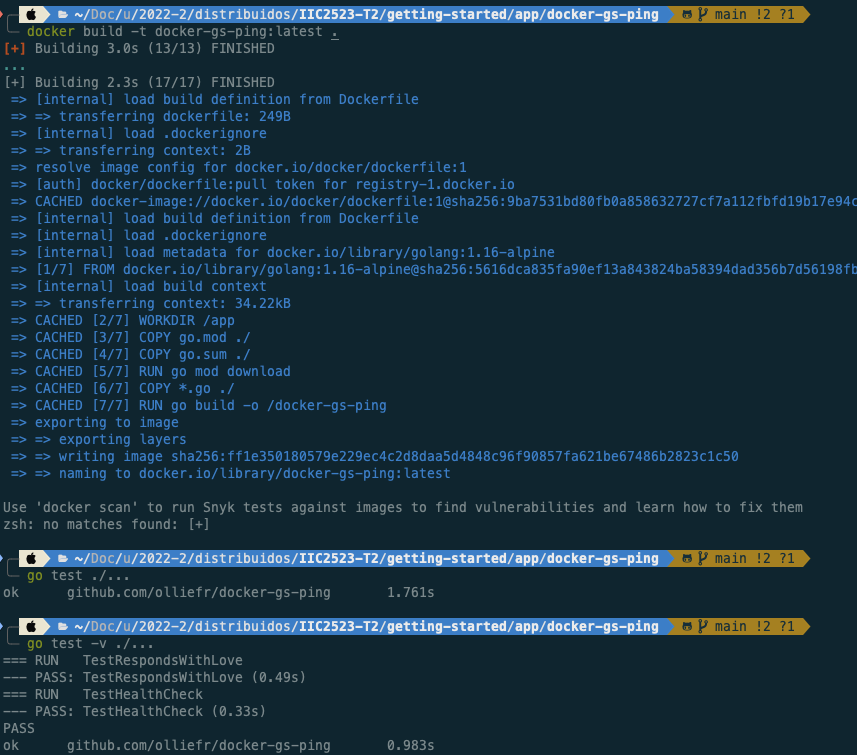

## 5 - CI/CD

Para este paso utilizamos Github Actions, en particular un template con un Dockerfile base y lo realizado fue crear unos secretos con los datos de login de dockerhub y luego crear una action que realiza lo siguiente:

- Checkout del repo
- Login en DockerHub (usando una action de Docker)
- Crea una instancia de BuildKit (usando una action de docker)
- Hace un push al repo de DockerHub (usando una action de docker)

Con lo anterior podemos ver que el workflow corre correctamente y luego la imagen está publicada en nuestra cuenta de dockerhub de manera automática.

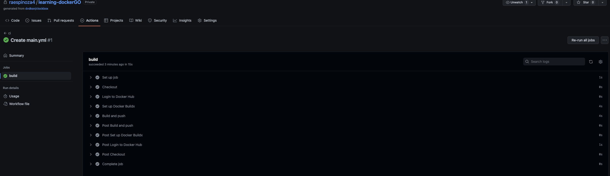

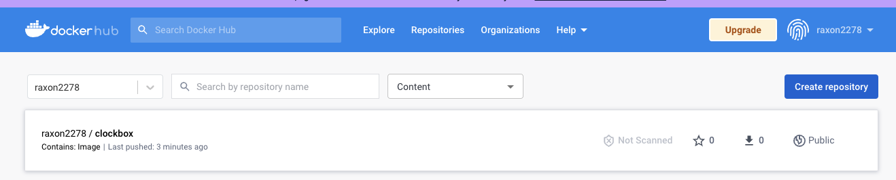

## 6 - Deploy

Docker ofrece deploys a servicios cloud, en particular Azure ACI y AWS EC2, pero también a Kubernetes desde Docker Desktop.

A modo general lo que podemos hacer es utilizar la CLI de docker-compose (o docker "normal") en cualquiera de los target de deploy mencionados anteriormente, se debe configurar un context de la aplicación (variables de entorno) y luego simplemente utilizar la CLI de docker-compose para montar los contenedores requeridos utilizando el context creado tal cual como si estuvieramos trabajando de forma local. Se pueden configurar rolling-updates, acceso a imágenes privadas ya que tenemos posibilidad de autenticación en los servicios a nuestra cuenta de DockerHub, volúmenes, auto scaling, etc... En conclusión, lo interesante de docker para los deploys es que podemos pullear las imágenes directamente desde un servicio cloud (o kubernetes) y trabajar con docker/docker-compose con todas las features que tenemos en local.

