# Parte 1 - Kubernetes

## 1 - Crear un clúster Kubernetes

Para crear un cluster se utiliza el comando `minikube start`, con ello se levanta un nodo de kubernetes el cual se puede comprobar corriendo `kubectl get nodes`

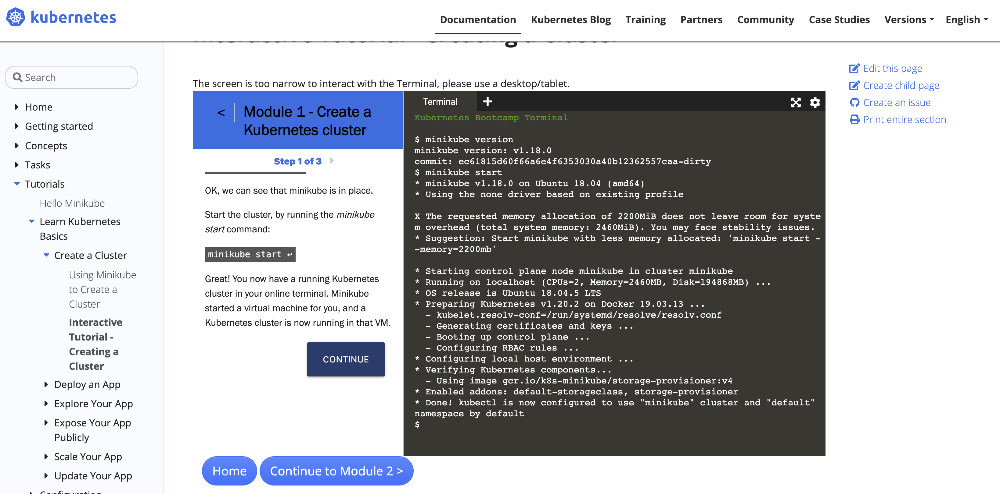

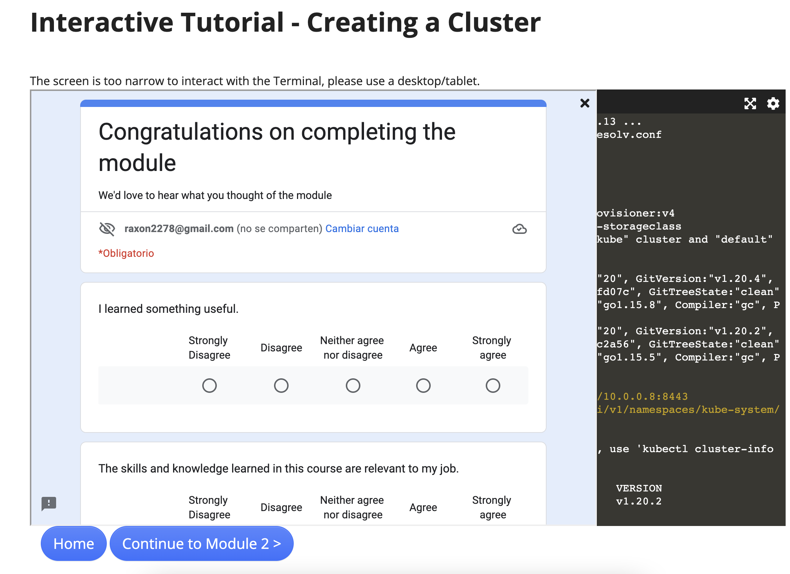

## 2 - Desplegar una app

Para crear un deployment se utiliza `kubectl create deployment name --image=appimagelocation`, luego podemos comprobar que el deployment se haya realizado con `kubectl get deployments`.

Si queremos acceder a red privada de los clusters debemos crear un proxy con `kubectl proxy`.

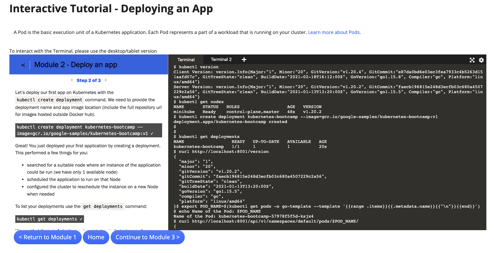

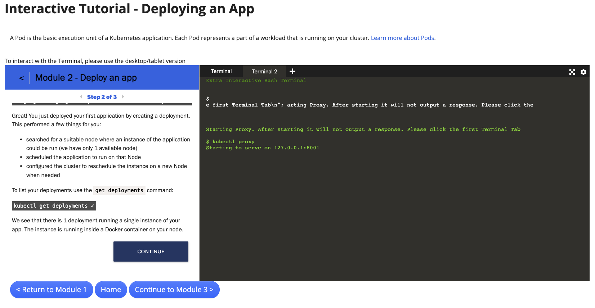

## 3 - Troubleshoot Kubernetes (get, describe, logs y exec).

Para obtener los pods que estan corriendo utlizamos `kubectl get pods` y para poder obtener información sobre estos pods corremos `kubectl describe pods` que contiene info como la IP, los puertos utilizados, eventos, etc...

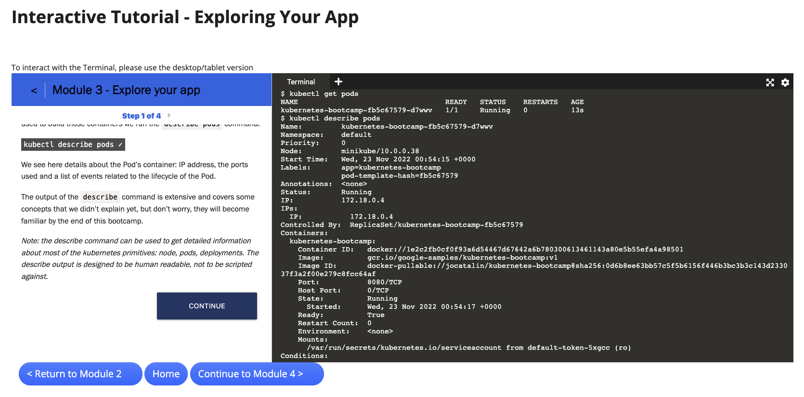

Para poder ver los logs de un pod se utiliza `kubectl logs POD_NAME`, que contiene todo lo que se ha enviado como STDOUT y para ejecutar comandos directamene en un pod podemos usar `kubectl exec POD_NAME -- COMMAND`

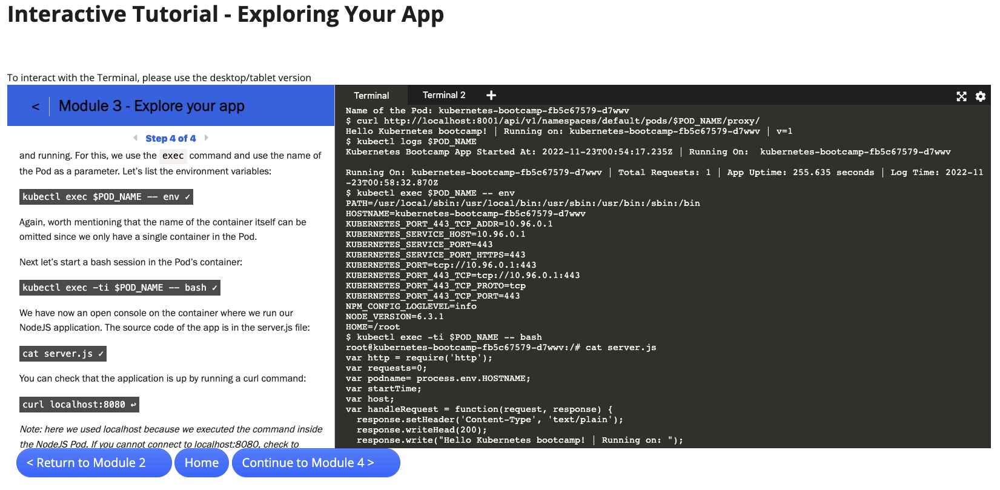

## 4 - Exponer una aplicación públicamente.

Para obtener los servicios en el cluster utilizamos `kubectl get services` y para poder crear un nuevo servicio `kubectl expose NAME --type="TYPE" --port PORT`

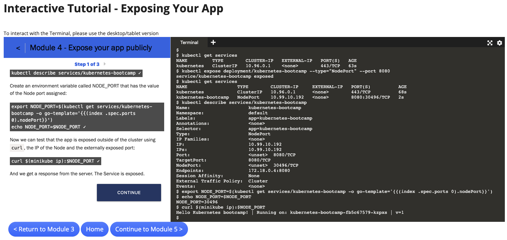

Para obtener las labels de un deployment podemos usar el comando de describe mencionado en la parte 3, también para crear labels se utiliza `kubectl label pods POD_NAME label=value` y podemos hacer llamados a comandos pidiendo exclusivamente los pods con X label.

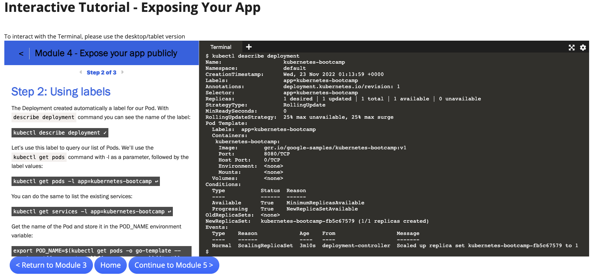

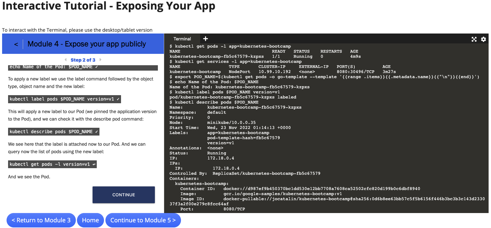

Podemos eliminar servicios con `kubetl delete service -l label=value`, lo que elimina el servicio pero la app sigue corriendo dentro del cluster ya que eso esta ligado al deployment, service solo expone la aplicación.

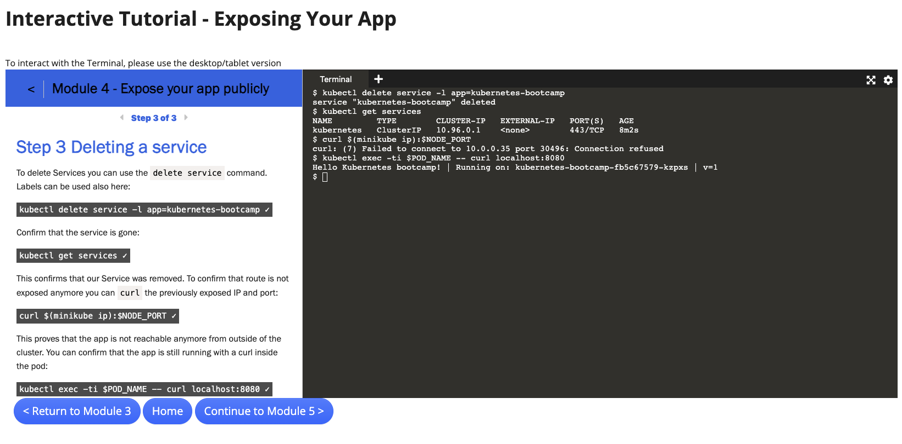

## 5 - Escalar una aplicación

Podemos obtener el ReplicaSet creado por un deployment con `kubectl get rs`, esto muestra 2 valores importantes, DESIRED que son las replicas "esperadas" en nuestra app y CURRENT que son las que realmente estan corriendo en el momento.

Para cambiar la cantidad de réplicar se utiliza el comanto `kubectl scale deployments/DEPLOYNAME --replicas=N`

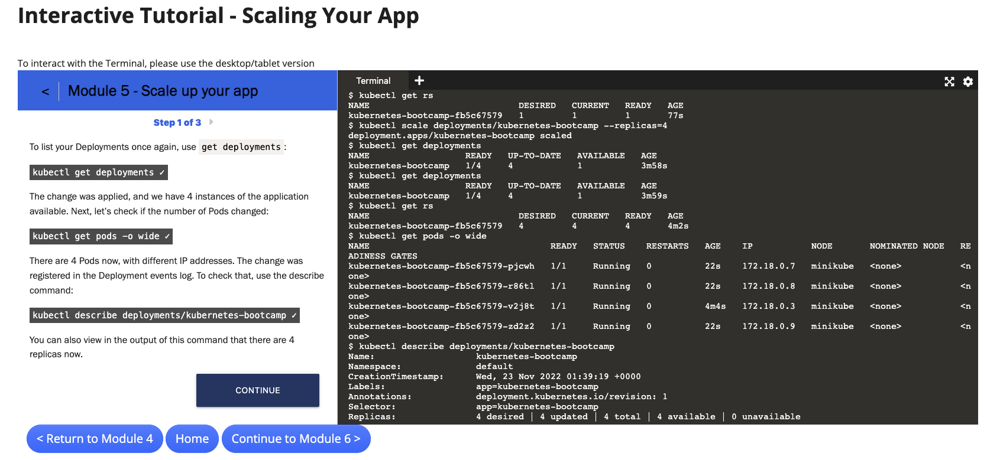

Automáticamente kubernetes aumenta la cantidad de pods y crea un load-balancer para distribuir la carga.

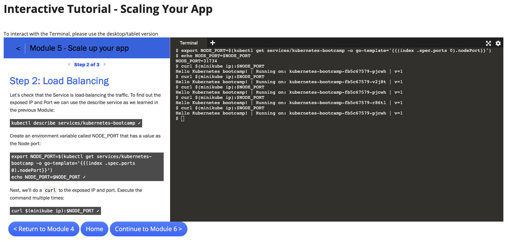

## 6 - Actualizar una aplicación

Para actualizar la imagen de una aplicación, se utiliza `kubectl set image deployments/NAME IMAGE`, esto automáticamente comienza un rolling update.

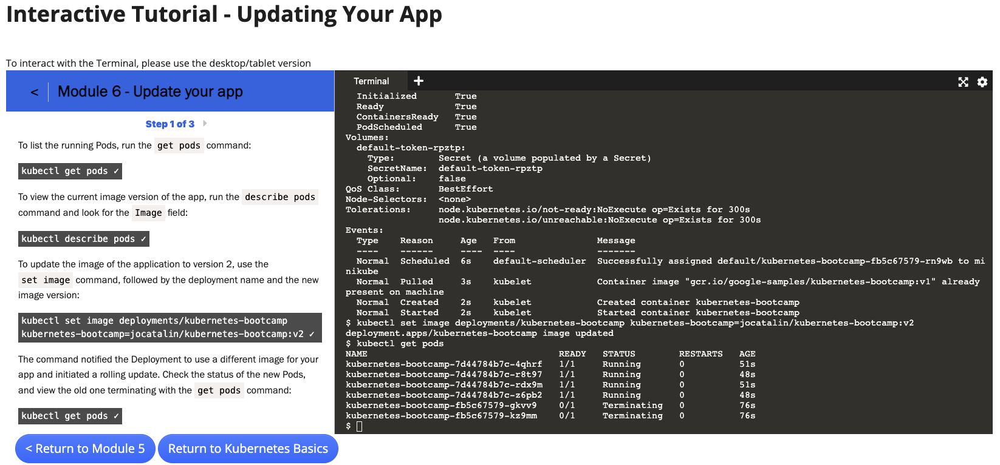

Podemos verificar el estado de un rolling update con `kubectl rollout status deployments/NAME`.

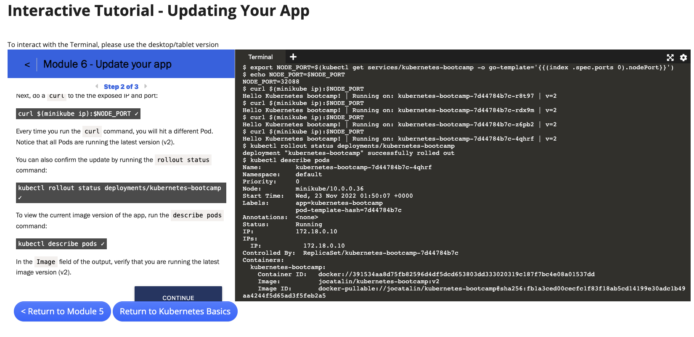

Para hacer un rollback de un deploy, se utiliza `kubectl rollout undo deployments/NAME` 

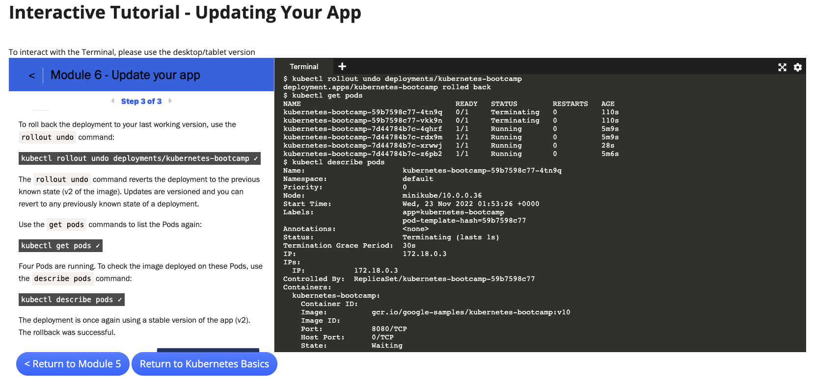
